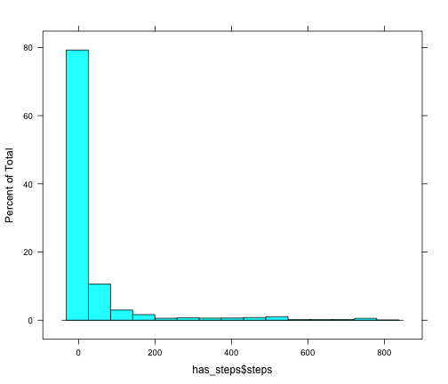
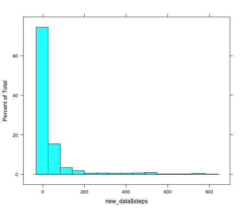
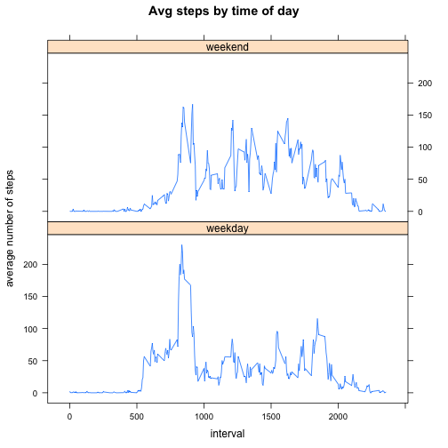

## Loading and preprocessing the data
First we load the data into a dataframe using read.csv.  Since the first steps of the assignment state that we can ignore missing values, a second dataframe is created with only those rows that have all the pieces of data.  This second dataframe is titled has_steps


```r
activity_data <- read.csv("activity.csv")
has_steps <- activity_data[!is.na(activity_data$steps), ]
```


## What is mean total number of steps taken per day?
The histogram below shows the distribution of steps taken.  As is evidenced by the histogram, the data is heavily skewed towards 0.

```r
library("lattice")
histogram(has_steps$steps)
```

 


The skewness is also evidenced by the mean and the medians of the data, which are computed below.


```r
mean(has_steps$steps)
```

```
## [1] 37.38
```

```r
median(has_steps$steps)
```

```
## [1] 0
```


## What is the average daily activity pattern?

To calculate the average daily activity pattern, we aggregate by time interval and take the mean:


```r
averages <- aggregate(has_steps$steps, by = list(has_steps$interval), FUN = mean)
labels <- c("Interval", "Average")
colnames(averages) <- labels
```


Here is a plot of the averages by time interval:


```r
plot(averages, type = "l", xlab = "interval", ylab = "average number of steps", 
    main = "Avg steps by time of day")
```

 


The interval which contains the largest average number of steps is the interval labeled "835", as evidenced by the code below:


```r
averages[which(averages$Average == max(averages$Average)), ]
```

```
##     Interval Average
## 104      835   206.2
```


## Imputing missing values

There are 2304 entries that do not have data for the number of steps.

```r
length(activity_data[, 1]) - length(has_steps[, 1])
```

```
## [1] 2304
```


We wish to fill in these missing values with the average value for that time period across the days that do have data.  We do that by first defining a function that will recognize when a value is missing, and then replace is with the aggregate average.  A new data set (titled "new_data") is created using this function.


```r
library(plyr)
impute.mean <- function(x) replace(x, is.na(x), mean(x, na.rm = TRUE))
new_data <- ddply(activity_data, ~interval, transform, steps = impute.mean(steps))
```


Here is a histogram of the new data.  Notice that the data is still skewed heavily towards 0.


```r
histogram(new_data$steps)
```

 


The new mean and median are below.  It is not surprising that the median did not change, considering the heavy skewness.  Also, the mean did not change, most likely due to the fact that we replaced the missing values with the mean for those time periods and the original missing values seemed to correspond to whole days.


```r
mean(new_data$steps)
```

```
## [1] 37.38
```

```r
median(new_data$steps)
```

```
## [1] 0
```


## Are there differences in activity patterns between weekdays and weekends?

Lastly, we would like to investigate whether or not there is a difference between activity on the weekends and weekdays.  The code below creates a new factor in the dataset that corresponds to the day of the week.  These values are then replaced with "weekday" or "weekend" as appropriate.


```r
new_data$weekday <- weekdays(as.Date(new_data$date))
tmp1 <- which(new_data$weekday == "Monday")
new_data$weekday[tmp1] = "weekday"
tmp1 <- which(new_data$weekday == "Tuesday")
new_data$weekday[tmp1] = "weekday"
tmp1 <- which(new_data$weekday == "Wednesday")
new_data$weekday[tmp1] = "weekday"
tmp1 <- which(new_data$weekday == "Thursday")
new_data$weekday[tmp1] = "weekday"
tmp1 <- which(new_data$weekday == "Friday")
new_data$weekday[tmp1] = "weekday"
tmp1 <- which(new_data$weekday == "Saturday")
new_data$weekday[tmp1] = "weekend"
tmp1 <- which(new_data$weekday == "Sunday")
new_data$weekday[tmp1] = "weekend"
```


The dataset created below aggregates the observations by interval and weekday/weekend label and computes the averages.


```r
waverages <- aggregate(new_data$steps, by = list(new_data$interval, new_data$weekday), 
    FUN = mean)
labels <- c("Interval", "WeekdayLabel", "Average")
colnames(waverages) <- labels
```


We then create plots to show the average steps by time of day for both the weekends and the weekdays.  As is evidenced in the plot, weekdays tend to have a larger peak earlier in the day (around the 800 interval) and then taper off.  The weekends, while they do have quite as large a peak at 800, they have a higher average number of steps as the day progresses.


```r
xyplot(waverages$Average ~ waverages$Interval | waverages$WeekdayLabel, type = "l", 
    xlab = "interval", ylab = "average number of steps", main = "Avg steps by time of day", 
    layout = c(1, 2))
```

 

